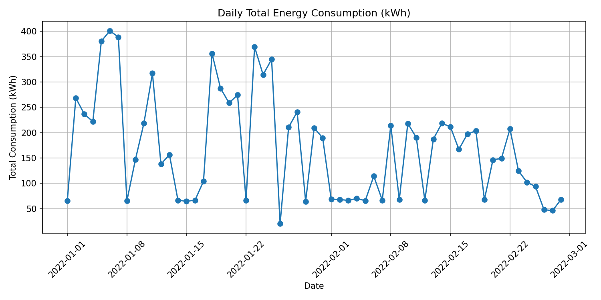
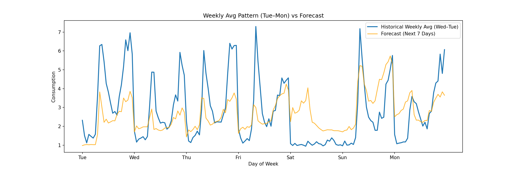

# IoT-Based Energy Consumption Analysis and Forecasting for Building Systems

## 0. Key Takeaways

- Building energy consumption exhibits clear **daily and weekly cycles**, with peaks in the morning and evening and troughs during early morning hours.  
- **LightGBM** outperforms RandomForest, XGBoost, and LSTM in prediction accuracy.  
- **IoT system optimisation** and energy management can leverage forecasts for load control and efficiency improvements.

## 1. Historical Consumption Patterns

- The energy consumption exhibits both **weekly and daily cycles**.  
- **Weekly pattern:** Very low or almost zero consumption during weekends; highest on weekdays.  
- **Daily pattern:** Peaks in the **morning (08:00–10:00)** and **evening to midnight (18:00–00:00)**; lowest consumption in the **early morning (00:00–06:00)**.  
- These patterns are consistent across multiple weeks, showing strong regularity in energy usage.

## 2. Feature Engineering

- **Temporal features:** `hour`, `day_of_week`, `is_weekend`  
- **Lag features:** `Consumption_lag_1`, `Consumption_lag_2`, `Consumption_lag_3`  
- **Rolling statistics:** `rolling_mean_1h`, `rolling_std_1h`  

> These features help capture daily and weekly patterns, as well as recent changes in consumption.

## 3. Model Comparison and Analysis

| Model         | RMSE  | MAE  | R²    | SMAPE (%) |
|---------------|-------|------|-------|-----------|
| RandomForest  | 0.91  | 0.52 | 0.81  | 21.8      |
| LightGBM      | 0.87  | 0.50 | 0.83  | 21.4      |
| XGBoost       | 0.90  | 0.56 | 0.82  | 26.4      |
| LSTM          | 1.03  | 0.54 | 0.83  | 71.2      |

### Detailed Analysis

- **RandomForest:** Accurate and robust; handles lag/rolling features well. May miss extreme spikes.  
- **LightGBM:** Best overall performance; smooth, stable predictions; captures nonlinear patterns effectively.  
- **XGBoost:** Sensitive to outliers; slightly higher relative errors.  
- **LSTM:** High SMAPE despite high R²; struggles due to irregular intervals, strong periodicity already captured by tree-based models, and alignment/hyperparameter issues.

> **Conclusion:** LightGBM is the most suitable model for IoT energy forecasting; RandomForest and XGBoost are competitive; LSTM underperforms on this dataset.

## 4. Forecast Results (Next 7 Days)

- **Peaks:** Slight underestimation during peak hours.  
- **Weekends:** Predictions for Saturday are slightly higher than actual.  
- **Troughs:** Low consumption slightly overestimated.

> Forecast captures daily/weekly cycles well, with minor deviations consistent with short-term fluctuations.

## 5. Insights & Optimisation Suggestions

- **Daily Cycles:** Focus on demand management during peak hours; consider load shifting or storage.  
- **Weekend Usage:** Schedule IoT maintenance or updates when consumption is low.  
- **Model Improvements:**  
  - Collect more frequent and regular time-stamped data.  
  - Incorporate weather or occupancy data.  
- **Feature Enhancement:** Explore holidays, special events, or temperature trends.  
- **IoT System Optimisation:**  
  - Use forecasts to optimise energy distribution and storage.  
  - Implement real-time anomaly detection for unexpected spikes/drops.

> Predictive insights combined with IoT control can significantly improve energy efficiency and grid stability.
---

### Appendix: LSTM Experiments

- **Raw data LSTM:**  
  RMSE = 1.030, MAE = 0.540, R² = 0.828, SMAPE = 71.18%  
  - Captures overall trends but produces very high relative errors; unreliable for operational use.

- **Hourly average data LSTM:**  
  RMSE = 0.678, MAE = 0.469, R² = 0.390, SMAPE = 32.67%  
  - Hourly average consumption used **alone** as input.  
  - Improved prediction of daily patterns and lower relative errors.  
  - However, R² dropped, showing less variance explained compared to tree-based models.

- **Analysis:**  
  - Irregular time intervals hinder learning temporal dependencies.  
  - Strong periodicity already captured by lag/rolling features.  
  - Sequence alignment and hyperparameters may still be suboptimal.

- **Recommendation:**  
  - Collect regular, time-stamped data.  
  - Add contextual features (occupancy, weather).  
  - Optimise sequence length and learning rate for improved LSTM performance.
